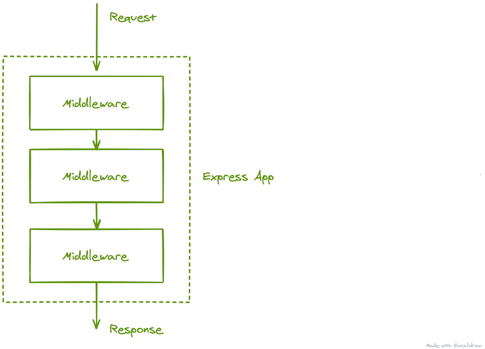

# Setup API Server

For our Map project, we need a robust and easy to use API Server. Luckily [Koa](https://koajs.com/) fits these requirements and is a nice API framework to use.

From the Koa website:

_"A Koa application is an object containing an array of middleware functions which are composed and executed in a stack-like manner upon request."_

The most basic Koa app with a single middleware, that returns "Hello world" for all requests is:

```js
const Koa = require('koa');
const app = new Koa();

app.use(async ctx => {
  ctx.body = 'Hello World';
});

app.listen(3000);
```

We can visualize the http request flowing through the layers like so:


Other frameworks, like [Express.js](https://expressjs.com/), will employ a top-down middleware flow similar to this:



This is not quite what Koa does.

Koa uses a cascade technique. Let's update our app to include a middleware function that logs how long each request took. A function would look like this:

```js
// time middleware
app.use(async (ctx, next) => {
  // Get current time
  const start = Date.now();
  // Call next middleware function...
  await next();
  // Subtract start from new current time
  const ms = Date.now() - start;
  // Log the duration
  console.log(`Request took ${ms}ms`);
});
```

The request would flow to the time middleware, would then flow to the next middleware which adds "Hello world" to the responses' body, and back to the time middleware:


I encourage you to read the overview on the [Koa website](https://koajs.com/) to gain some intuition. We will abstract away some of these core ideas by leveraging the [Koa Router](https://github.com/ZijianHe/koa-router) pakage so no worries! More to come later!