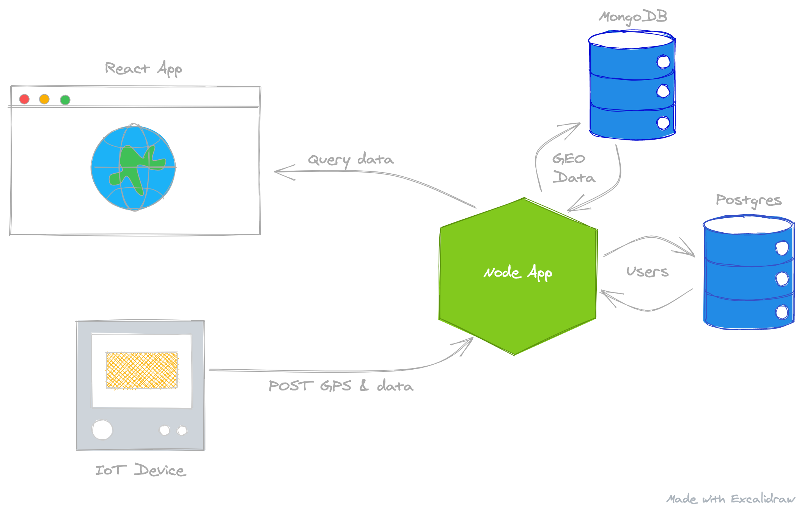

# Design and Build API

One of the biggest problems with software today is that people do not spend enough time in the "design" phase. It has become easier to iterate and change code, but if we spend some extra time up front and think through our system, we will mitigate a lot of potential changes.

Why are we using two different databases?

For the purpose of this course, it's to show you how to setup two different kinds of databases. In reality, we could use either one for Users and Data with GPS coordinates. Mongo is more freeform and has a nice way to query and aggregate with GPS. Postgres is relational and suites models that are connected to eachother. For example, if we have a User, and that user has a few addresses, we have a One To Many relationship. We could get Mongo to play well with relationships, and we can make Postgres aggregate based on latitude/longitude, but we will learn a bit about both and leverage their strengths.

My advice for a real world application: If you don't know how your data will be structured and connected, prototype with a NoSQL database such as Mongo. If you have well-defined models that have structured relationships go with Postgres. 

So right now our system might be something like this:

We can then think of what we want our API endpoints to look like. For retrieving Users, perhaps something like:

| Operation | Request Method | Request Path           | Response Status | Response Body |
|-----------|----------------|------------------------|-----------------|---------------|
| Get Users | GET            | `/api/<version>/users` | 200             | [User]        |

And if we wanted to just retrieve a User by the user's ID, we can add an `/:id` to the Path of the above to make a new endpoint:

| Operation      | Request Method | Request Path               | Response Status | Response Body |
|----------------|----------------|----------------------------|-----------------|---------------|
| Get User By ID | GET            | `/api/<version>/users/:id` | 200             | User          |

> It's usually best practice to version API's. We can then support multiple versions of the Get Users endpoint.

For Creating, Retrieving, Updating and Deleting Users, a flushed out API might look like this:

> The `5` in the Rquest Path below represents the User's ID

| Operation      | Request Method | Request Body | Request Path    | Response Status | Response Body |
|----------------|----------------|--------------|-----------------|-----------------|---------------|
| Get Users      | GET            |              | /api/v1/users   | 200             | [User]        |
| Get User By ID | GET            |              | /api/v1/users/5 | 200             | User          |
| Create User    | POST           | User         | /api/v1/users   | 201             | User          |
| Update User    | PUT            | User         | /api/v1/users/5 | 200             | User          |
| Delete User    | DELETE         |              | /api/v1/users/5 | 204             |               |