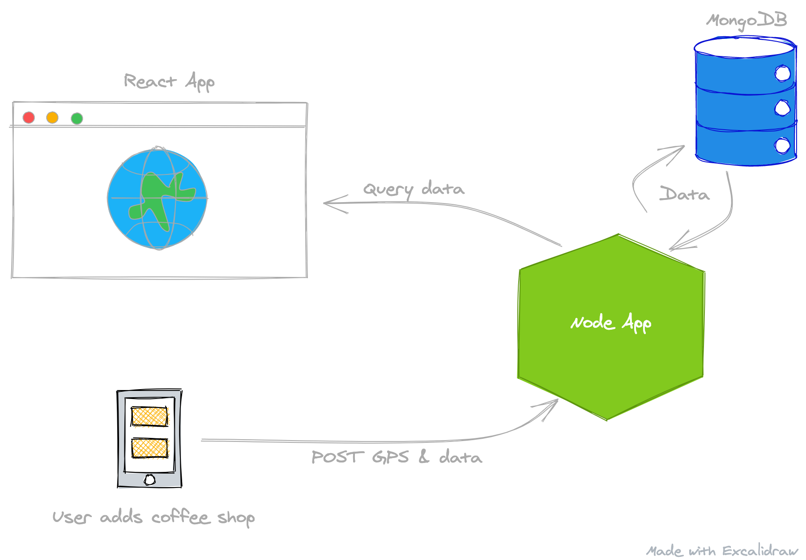

# Design and Build API

One of the biggest problems with software today is that people do not spend enough time in the "design" phase. It has become easier to iterate and change code, but if we spend some extra time in the beginning to think through our system, we will mitigate a lot of potential changes.

Why Mongo?

Mongo is a NoSQL database, which mostly means it is more freeform and offers us some flexibility in the prototyping phase. It also has a nice way to query and aggregate with GPS coordinates. Mongo documents are essentially JSON documents, so Mongo works well with JavaScript based applications. My advice for a real world application with limits on design time: If you don't know how your data will be structured and connected, prototype with a NoSQL database such as Mongo. If you have well-defined models with structured relationships, then go with a SQL database like Postgres. 

So right now our system might be something like this:

We can then think of what we want our API endpoints to look like. For retrieving Users, perhaps something like:

| Operation | Request Method | Request Path           | Response Status | Response Body |
|-----------|----------------|------------------------|-----------------|---------------|
| Get Users | GET            | `/api/<version>/users` | 200             | [User]        |

And if we wanted to just retrieve a User by the user's ID, we can add an `/:id` to the Path of the above to make a new endpoint:

| Operation      | Request Method | Request Path               | Response Status | Response Body |
|----------------|----------------|----------------------------|-----------------|---------------|
| Get User By ID | GET            | `/api/<version>/users/:id` | 200             | User          |

> It's usually best practice to version API's. We can then support multiple versions of the Get Users endpoint.

For "CRUD" (Creating, Retrieving, Updating and Deleting) Users, a flushed out API might look like this:

> The `5` in the Request Path below represents the User's ID

| Operation      | Request Method | Request Body | Request Path    | Response Status | Response Body |
|----------------|----------------|--------------|-----------------|-----------------|---------------|
| Get Users      | GET            |              | /api/v1/users   | 200             | [User]        |
| Get User By ID | GET            |              | /api/v1/users/5 | 200             | User          |
| Create User    | POST           | User         | /api/v1/users   | 201             | User          |
| Update User    | PUT            | User         | /api/v1/users/5 | 200             | User          |
| Delete User    | DELETE         |              | /api/v1/users/5 | 204             |               |